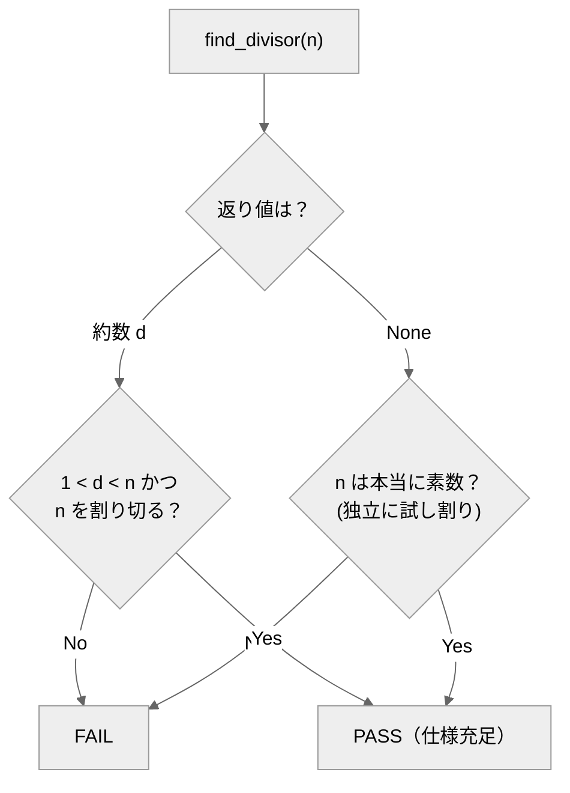

# spec-divisor-finder-agent

整数 n の**非自明な約数を1つ**返す `find_divisor(n)` を実装するエージェントと、**出力が一意でない処理を「仕様を満たすか」で判定する**オラクル（採点プログラム）。

## 概要

約数のように**答えが1つに決まらない**（12 なら 2 でも 3 でも 6 でも正解）処理は、保存した正解との一致では測れません。
このリポジトリは、正しさを**出力が満たすべき仕様**で確かめる **仕様（アサーション）オラクル** の実例です。

返した d については「1<d<n かつ割り切る」、None については「本当に素数か」を、**オラクルが独立に再計算して**照合します。答えを知らなくても答えの正しさは検証できる――という考え方の実例です。

## クイックスタート

必要なもの：Python 3 のみ。**リポジトリのルートで実行**。

```bash
python eval/oracle.py            # 正しい約数発見(reference)を採点 → PASS
python eval/oracle.py --selftest # オラクル自身を検証（②でFAILが出るのが正常）
```

→ ①は採点表に `PASS`、②は最後に `## オラクル判定: PASS`。どちらも終了コード 0（②で壊れた実装に FAIL が出るのは正常）。

## エージェントの動かし方

`.claude/agents/spec-divisor-finder-agent.md` の指示で `candidate.py` に `find_divisor(n)` を実装し、`python eval/oracle.py --candidate candidate` で採点。candidate が無くても `reference` で全工程を再現できます。

## しくみ



## 合否（eval）
n=2..5000 の各 n で、約数を返すなら 1<d<n かつ割り切れ、None を返すなら本当に素数。すべて満たせば PASS。

## ファイル構成
- `.claude/agents/…md` … エージェント定義／`eval/oracle.py` … 仕様オラクル（`--selftest` 内蔵）
- `eval/corpus/reference.py` … 正例／`broken_*.py` … 既知バグ（陰性対照）
- `design/design.md` … 設計の考え方

---
自作 AI エージェント集（評価駆動開発の実証）の一つ。背景は [design/design.md](design/design.md)。
